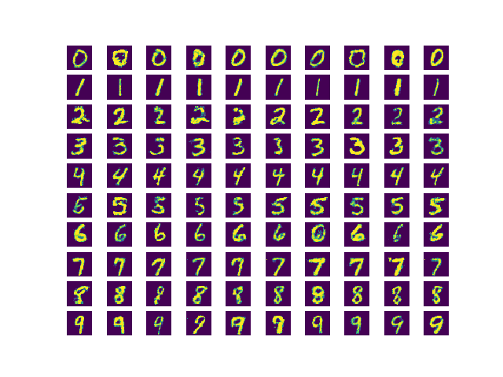
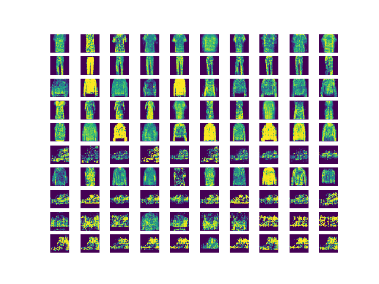

# Conditional-GAN
I implemented conditional GAN which consists of MLP-Based Generator and Discriminator, and each component has conditional variables as a input. For training dataset, I used digit-MNIST dataset and Fashion-MNIST. 

## Dataset
1. MNIST dataset (http://yann.lecun.com/exdb/mnist/) 
2. Fashion-MNIST dataset (https://github.com/zalandoresearch/fashion-mnist)

## Dependencies
1. Python==3.5
2. Tensorflow==1.0.0
3. Matplotlib==2.1.1

## Usage

<pre><code>python ./train.py</code></pre>

## Results
1. MNIST-digit

2. MNIST-fashion

## Reference
1. Conditional Generative Adversarial Nets (https://arxiv.org/abs/1411.1784)
